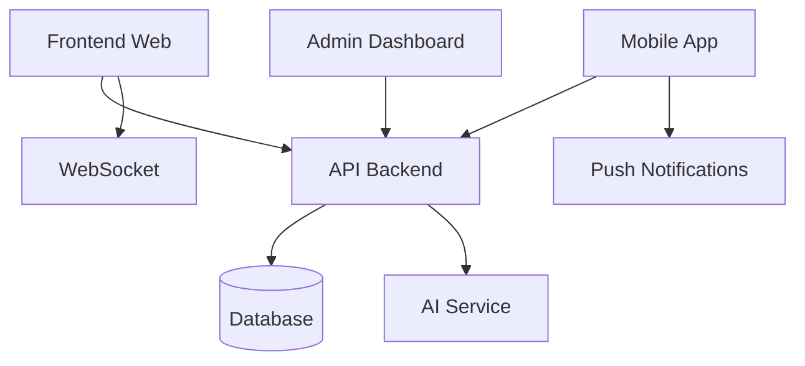

# 📱 Apps - TSA-Logistique

> Applications frontend modernes pour la plateforme logistique TSA

## 📋 Vue d'Ensemble

Le dossier `apps/` contient toutes les applications frontend de TSA-Logistique, construites avec les dernières technologies React et React Native. Chaque application cible un usage spécifique et offre une expérience utilisateur optimisée.

## 🏗️ Architecture des Applications

```
apps/
├── frontend-web/             # 🌐 Application web principale (React)
├── mobile-app/               # 📱 Application mobile (React Native)
```

## 🌐 Frontend Web

**Stack :** React 18 + TypeScript + Vite + Tailwind CSS

### Responsabilités
- **Interface utilisateur principale** pour transporteurs et affréteurs
- **Marketplace logistique** avec système d'enchères
- **E-commerce intégré** avec boutique produits
- **Tracking temps réel** des missions
- **Gestion de profil** et KYC
- **Chat et support** client
- **Responsive design** mobile-first

### Architecture Interne
```
frontend-web/
├── public/                   # Assets statiques
├── src/
│   ├── components/          # Composants réutilisables
│   │   ├── ui/             # Composants UI de base
│   │   ├── forms/          # Composants de formulaires
│   │   ├── layout/         # Composants de layout
│   │   ├── charts/         # Graphiques et analytics
│   │   └── maps/           # Composants cartographiques
│   ├── pages/              # Pages de l'application
│   │   ├── auth/           # Authentification
│   │   ├── dashboard/      # Tableaux de bord
│   │   ├── missions/       # Gestion missions
│   │   ├── shop/           # E-commerce
│   │   ├── kyc/            # Vérification KYC
│   │   ├── profile/        # Gestion profil
│   │   └── support/        # Support client
│   ├── hooks/              # Hooks React personnalisés
│   ├── services/           # Services API
│   ├── stores/             # Gestion d'état (Zustand)
│   ├── utils/              # Utilitaires
│   ├── types/              # Types TypeScript
│   └── styles/             # Styles globaux
├── tests/                  # Tests (Jest + Testing Library)
└── e2e/                   # Tests E2E (Playwright)
```

### Fonctionnalités Principales
- **🏠 Dashboard** : Vue d'ensemble missions, analytics
- **🚚 Missions** : Création, enchères, suivi temps réel
- **🛒 E-commerce** : Catalogue, panier, checkout
- **👤 Profil** : Gestion compte, documents, préférences
- **💬 Chat** : Communication temps réel
- **📊 Analytics** : Statistiques et rapports

### Démarrage Rapide
```bash
cd apps/frontend-web

# Installation
pnpm install

# Configuration
cp .env.example .env.local

# Développement
pnpm dev        # http://localhost:3000

# Build
pnpm build
pnpm preview    # Aperçu du build
```

### Scripts Disponibles
```bash
pnpm dev          # Mode développement avec HMR
pnpm build        # Build production optimisé
pnpm preview      # Aperçu du build local
pnpm test         # Tests unitaires (Jest)
pnpm test:e2e     # Tests E2E (Playwright)
pnpm lint         # ESLint + Prettier
pnpm type-check   # Vérification TypeScript
```

## 📱 Mobile App

**Stack :** React Native + Expo + TypeScript

### Responsabilités
- **Application mobile native** iOS/Android
- **Tracking GPS** en temps réel
- **Notifications push** pour missions
- **Scan QR codes** pour livraisons
- **Mode offline** pour zones rurales
- **Géolocalisation** optimisée
- **Interface adaptée mobile**

### Architecture Interne
```
mobile-app/
├── assets/                  # Images, icônes, fonts
├── src/
│   ├── components/         # Composants réutilisables
│   ├── screens/           # Écrans de l'application
│   │   ├── auth/          # Authentification
│   │   ├── missions/      # Gestion missions
│   │   ├── tracking/      # Suivi GPS
│   │   ├── profile/       # Profil utilisateur
│   │   └── notifications/ # Notifications
│   ├── navigation/        # Navigation React Navigation
│   ├── hooks/            # Hooks React Native
│   ├── services/         # Services API mobiles
│   ├── stores/           # État global (Zustand)
│   ├── utils/            # Utilitaires mobiles
│   └── types/            # Types TypeScript
├── app.json              # Configuration Expo
└── eas.json             # Configuration EAS Build
```

### Fonctionnalités Mobiles
- **📍 GPS Tracking** : Suivi position temps réel
- **📷 Photo Upload** : Documents, preuves livraison
- **🔔 Push Notifications** : Alertes missions
- **📶 Mode Offline** : Synchronisation intelligente
- **🗺️ Maps intégrées** : Navigation optimisée
- **🔐 Biométrie** : Authentification empreinte/face

### Démarrage Rapide
```bash
cd apps/mobile-app

# Installation
pnpm install

# Configuration
cp .env.example .env

# Développement
pnpm start      # Serveur Expo
pnpm android    # Émulateur Android
pnpm ios        # Simulateur iOS

# Build
pnpm build:android
pnpm build:ios
```

### Scripts Disponibles
```bash
pnpm start        # Serveur de développement Expo
pnpm android      # Ouvrir sur émulateur Android
pnpm ios          # Ouvrir sur simulateur iOS
pnpm web          # Version web (pour tests)
pnpm test         # Tests React Native
pnpm lint         # ESLint pour React Native
```

## ⚙️ Admin Dashboard

**Stack :** React 18 + TypeScript + Vite + Tailwind CSS

### Responsabilités
- **Interface d'administration** pour gestionnaires
- **Analytics avancées** et KPIs
- **Gestion utilisateurs** et permissions
- **Modération contenu** et missions
- **Configuration système** et paramètres
- **Rapports financiers** et statistiques
- **Monitoring opérationnel**


### Fonctionnalités Admin
- **📊 Analytics** : Métriques temps réel, conversions
- **👥 Users Management** : CRUD utilisateurs, permissions
- **🚚 Missions Oversight** : Modération, résolution conflits
- **💰 Financial Reports** : Revenus, commissions, payouts
- **⚙️ System Config** : Paramètres plateforme
- **🔍 Audit Logs** : Traçabilité des actions

```

## 🎨 Design System & UI

### Composants Partagés
Les applications partagent un design system cohérent :

```typescript
// Composants UI de base
import { Button, Input, Modal, Card } from '@/components/ui'

// Variantes et thèmes
<Button variant="primary" size="lg">
<Input type="email" validation="required">
<Modal size="xl" backdrop="blur">
```

### Tailwind CSS Configuration
```javascript
// tailwind.config.js partagé
module.exports = {
  theme: {
    extend: {
      colors: {
        primary: '#3B82F6',    // Bleu TSA
        secondary: '#10B981',  // Vert
        accent: '#F59E0B',     // Orange
      },
      fontFamily: {
        sans: ['Inter', 'sans-serif'],
      },
    },
  },
}
```

### Responsive Design
- **Mobile First** : Design adaptatif
- **Breakpoints** : sm, md, lg, xl, 2xl
- **Touch Friendly** : Boutons 44px minimum
- **Accessibility** : WCAG 2.1 AA compliance

## 🔄 Communication avec Backend

### Architecture de Communication


### Services API
```typescript
// services/api.ts
export const api = {
  auth: {
    login: (credentials) => post('/auth/login', credentials),
    logout: () => post('/auth/logout'),
  },
  missions: {
    list: (filters) => get('/missions', { params: filters }),
    create: (mission) => post('/missions', mission),
  },
  // ...
}
```

### WebSocket Integration
```typescript
// hooks/useWebSocket.ts
export const useWebSocket = () => {
  const [socket, setSocket] = useState<Socket>()
  
  useEffect(() => {
    const newSocket = io(WS_URL)
    setSocket(newSocket)
    
    return () => newSocket.close()
  }, [])
  
  return socket
}
```

## 🛠️ Développement

### Scripts Monorepo
```bash
# Démarrer toutes les apps
pnpm dev

# Démarrer une app spécifique
pnpm dev:web         # Frontend web
pnpm dev:mobile      # App mobile
pnpm dev:admin       # Dashboard admin

# Tests
pnpm test:apps       # Tous les tests apps
pnpm test:web        # Tests frontend web
pnpm test:mobile     # Tests mobile

# Build
pnpm build:apps      # Build toutes les apps
```

### Hot Module Replacement
- **Vite HMR** : Rechargement instantané web
- **Expo Fast Refresh** : Rechargement rapide mobile
- **État préservé** : Pas de perte de state

### TypeScript Integration
```json
// tsconfig.json partagé
{
  "compilerOptions": {
    "strict": true,
    "jsx": "react-jsx",
    "moduleResolution": "bundler",
    "baseUrl": ".",
    "paths": {
      "@/*": ["./src/*"],
      "@tsa/shared-types": ["../../packages/shared-types"]
    }
  }
}
```

## 📱 Progressive Web App (PWA)

### Fonctionnalités PWA
- **Service Worker** : Cache intelligent
- **Install Prompt** : Installation native
- **Offline Mode** : Fonctionnement hors ligne
- **Background Sync** : Synchronisation différée
- **Push Notifications** : Notifications web

### Configuration PWA
```javascript
// vite.config.ts
import { VitePWA } from 'vite-plugin-pwa'

export default defineConfig({
  plugins: [
    VitePWA({
      registerType: 'autoUpdate',
      workbox: {
        globPatterns: ['**/*.{js,css,html,ico,png,svg}'],
      },
      manifest: {
        name: 'TSA Logistique',
        short_name: 'TSA',
        theme_color: '#3B82F6',
        icons: [
          {
            src: 'icon-192.png',
            sizes: '192x192',
            type: 'image/png',
          },
        ],
      },
    }),
  ],
})
```

## 🧪 Tests & Qualité

### Stratégie de Tests
- **Unit Tests** : Jest + Testing Library
- **Integration Tests** : API mocking
- **E2E Tests** : Playwright (web), Detox (mobile)
- **Visual Regression** : Chromatic/Percy

### Configuration Tests
```javascript
// jest.config.js
module.exports = {
  testEnvironment: 'jsdom',
  setupFilesAfterEnv: ['<rootDir>/src/test-setup.ts'],
  moduleNameMapping: {
    '^@/(.*)$': '<rootDir>/src/$1',
  },
  collectCoverageFrom: [
    'src/**/*.{ts,tsx}',
    '!src/**/*.d.ts',
  ],
}
```

### Quality Gates
- **Code Coverage** : > 80%
- **TypeScript** : Strict mode, no errors
- **ESLint** : Zero warnings
- **Lighthouse** : Score > 90

## 🚀 Build & Déploiement

### Build Optimization
- **Tree Shaking** : Code splitting automatique
- **Bundle Analysis** : Webpack Bundle Analyzer
- **Image Optimization** : Format WebP, lazy loading
- **Code Compression** : Gzip/Brotli

### Déploiement par App
| Application | Staging | Production |
|-------------|---------|------------|
| **Frontend Web** | Vercel Preview | Vercel |
| **Mobile App** | Expo Development | App Store / Play Store |
| **Admin Dashboard** | Netlify | Netlify |

### CI/CD Pipeline
```yaml
# .github/workflows/apps-ci.yml
name: Apps CI/CD
on:
  push:
    paths: ['apps/**']

jobs:
  test:
    runs-on: ubuntu-latest
    steps:
      - uses: actions/checkout@v3
      - run: pnpm test:apps
      
  build:
    runs-on: ubuntu-latest
    steps:
      - uses: actions/checkout@v3
      - run: pnpm build:apps
      
  deploy:
    if: github.ref == 'refs/heads/main'
    runs-on: ubuntu-latest
    steps:
      - uses: actions/checkout@v3
      - run: pnpm deploy:apps
```

## 📊 Performance & Analytics

### Web Vitals
- **LCP** : < 2.5s (Largest Contentful Paint)
- **FID** : < 100ms (First Input Delay)
- **CLS** : < 0.1 (Cumulative Layout Shift)

### Mobile Performance
- **Bundle Size** : < 25MB total
- **Startup Time** : < 3s cold start
- **Memory Usage** : < 150MB moyenne
- **Battery Impact** : Optimisé pour autonomie

### Analytics Integration
```typescript
// utils/analytics.ts
export const analytics = {
  track: (event: string, properties?: object) => {
    // Plausible Analytics
    plausible(event, { props: properties })
  },
  
  page: (path: string) => {
    plausible('pageview', { props: { path } })
  },
}
```

## 🔐 Sécurité Frontend

### Content Security Policy
```html
<meta http-equiv="Content-Security-Policy" 
      content="default-src 'self'; 
               script-src 'self' 'unsafe-inline';
               style-src 'self' 'unsafe-inline';">
```

### Input Validation
```typescript
// Validation avec Zod
import { z } from 'zod'

const loginSchema = z.object({
  email: z.string().email(),
  password: z.string().min(8),
})

export const validateLogin = (data: unknown) => {
  return loginSchema.parse(data)
}
```

### Authentification
- **JWT Storage** : httpOnly cookies
- **Auto Refresh** : Token refresh automatique
- **Route Protection** : Guards sur routes sensibles
- **RBAC** : Role-based access control

## 🌍 Internationalisation

### Configuration i18n
```typescript
// i18n/config.ts
export const i18n = {
  defaultLocale: 'fr',
  locales: ['fr', 'en', 'ar'],
  fallbackLocale: 'fr',
}

// Usage
const { t } = useTranslation()
return <h1>{t('welcome.title')}</h1>
```

### Localisation
- **Français** : Langue principale (Afrique francophone)
- **Anglais** : Marchés anglophones
- **Arabe** : Afrique du Nord
- **Formats** : Dates, nombres, devises localisés

## 🆘 Troubleshooting

### Problèmes Courants

#### App ne démarre pas
```bash
# Nettoyer les dépendances
rm -rf node_modules package-lock.json
pnpm install

# Vérifier la version Node.js
node --version  # Doit être 18+

# Vérifier les variables d'environnement
cat .env.local
```

#### Build échoue
```bash
# Vérifier TypeScript
pnpm type-check

# Vérifier ESLint
pnpm lint

# Build en mode debug
pnpm build --debug
```

#### Performance dégradée
```bash
# Analyser le bundle
p