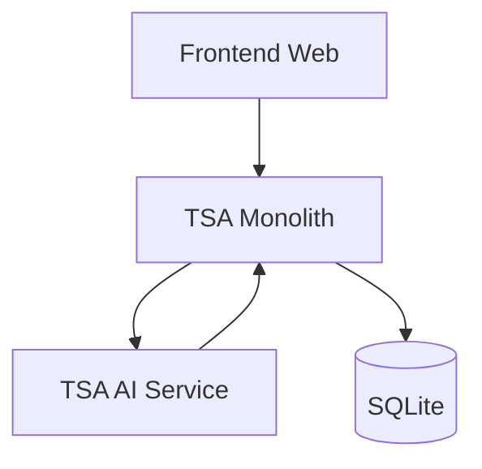

# 🔧 Services - TSA-Logistique

> Architecture microservices backend pour la plateforme logistique TSA

## 📋 Vue d'Ensemble

Le dossier `services/` contient tous les services backend de TSA-Logistique, construits selon une architecture microservices moderne. Chaque service est indépendant, scalable et communique via des APIs REST bien définies.

## 🏗️ Architecture des Services

```
services/
├── tsa-monolith/             # 🔑 API principale (AdonisJS)
└── tsa-ai/                   # 🤖 Intelligence artificielle (FastAPI)
```

## 🔑 TSA Monolith

**Stack :** AdonisJS 6 + TypeScript + SQLite (dev)

### Responsabilités
- **Authentification & autorisation** (JWT, sessions)
- **Gestion utilisateurs** et profils
- **CRUD missions** de transport
- **Système d'enchères** pour missions
- **Gestion produits** e-commerce
- **Traitement commandes** et paiements
- **KYC & vérification** d'identité
- **Chat temps réel** (WebSocket)
- **APIs REST** pour frontends

### Architecture Interne
```
tsa-monolith/
├── app/
│   ├── exceptions/          # Gestion des exceptions
│   ├── middleware/          # Middlewares HTTP
│   └── models/             # Modèles Lucid ORM (User)
├── bin/                    # Scripts de démarrage
├── config/                 # Configuration AdonisJS
├── database/              # Migrations et seeders
├── start/                 # Routes et kernel
└── tests/                # Tests (bootstrap)
```

### Démarrage Rapide
```bash
cd services/tsa-monolith

# Installation
npm install

# Configuration
cp .env.example .env

# Base de données
node ace migration:run

# Développement
npm run dev     # http://localhost:3333
```

### APIs Principales
| Endpoint | Description |
|----------|-------------|
| `GET /api/health` | Status du service |
| `POST /api/auth/login` | Connexion utilisateur |
| `GET /api/missions` | Liste des missions |
| `POST /api/products` | Créer un produit |
| `GET /api/users/profile` | Profil utilisateur |
| `POST /api/kyc/documents` | Upload documents KYC |

## 🤖 TSA AI Service

**Stack :** FastAPI + Python + SQLite

### Responsabilités
- **Optimisation de routes** via algorithmes ML
- **Prédiction de demande** transport
- **Matching intelligent** missions ↔ transporteurs
- **Analyse prédictive** des prix
- **Recommandations produits** e-commerce
- **Détection d'anomalies** dans les trajets
- **Analytics avancées** et insights

### Architecture Interne
```
tsa-ai/
├── app/
│   ├── core/              # Configuration et dépendances
│   ├── endpoints/         # Routes FastAPI (health, eta)
│   ├── models/           # Modèles de base de données
│   ├── schemas/          # Schémas Pydantic
│   ├── services/         # Services métier (ETA)
│   └── main.py           # Application FastAPI
├── ml_models/            # Modèles ML
├── notebooks/            # Jupyter notebooks R&D
├── scripts/              # Scripts utilitaires
└── tests/               # Tests Python
```

### Démarrage Rapide
```bash
cd services/tsa-ai

# Environnement virtuel Python
python -m venv venv
source venv/bin/activate  # Windows: venv\Scripts\activate

# Installation
pip install -r requirements.txt

# Configuration
cp .env.example .env

# Développement
uvicorn app.main:app --reload --host 0.0.0.0 --port 8000
```

### APIs ML Disponibles
| Endpoint | Description |
|----------|-------------|
| `GET /api/v1/health` | Status du service IA |
| `POST /api/v1/eta/predict` | Prédiction ETA de livraison |


## 🔄 Communication Inter-Services

### Architecture de Communication


### Patterns de Communication
- **Synchrone** : HTTP REST entre TSA Monolith ↔ TSA AI Service
- **Base de données** : SQLite pour développement

## 🛠️ Développement

### Scripts Monorepo
```bash
# Démarrer le monolith
cd services/tsa-monolith && npm run dev

# Démarrer le service IA
cd services/tsa-ai && source venv/bin/activate && uvicorn app.main:app --reload

# Tests
npm test            # Tests monolith
pytest tests/       # Tests service IA
```


## 🔐 Configuration

### Variables d'Environnement Communes
```env
# Base de données
DATABASE_URL=sqlite:///./tsa_contest.db

# Services internes
ADONIS_API_URL=http://localhost:3333
FAST API_BASE_URL=http://localhost:8000

# Configuration
APP_KEY=your_super_secret_app_key
NODE_ENV=development
```

### Configuration par Service
- **TSA Monolith** : `.env` avec configuration AdonisJS et SQLite
- **TSA AI Service** : `.env` avec configuration FastAPI et modèles ML

## 📊 Monitoring & Observabilité

### Logs
- **Structured logging** avec Winston/Pino
- **Correlation IDs** pour traçabilité
- **Centralization** via ELK Stack ou Grafana Loki

### Métriques
- **Application metrics** : Prometheus + Grafana
- **Health checks** : `/health` sur chaque service
- **Performance monitoring** : APM (Sentry, New Relic)

### Alerting
- **Uptime monitoring** : UptimeRobot/Pingdom
- **Error tracking** : Sentry
- **Slack/Discord** notifications

## 🚀 Déploiement

### Environnements
| Service | Staging | Production |
|---------|---------|------------|
| **TSA Monolith** | Railway | Railway |
| **TSA AI Service** | Render | Render |

### CI/CD Pipeline
1. **Tests** automatiques sur PR
2. **Build** Docker images
3. **Deploy** staging sur merge `integration`
4. **Deploy** production sur merge `main`
5. **Health checks** post-déploiement

### Docker
```bash
# Build toutes les images
docker-compose build

# Push vers registry
docker-compose push

# Deploy production
docker-compose -f docker-compose.prod.yml up -d
```

## 🧪 Tests

### Stratégie de Tests
- **Unit tests** : Logique métier isolée
- **Integration tests** : Communication entre services
- **E2E tests** : Scénarios utilisateur complets
- **Load tests** : Performance sous charge

### Commandes de Test
```bash
# Tests unitaires
pnpm test:unit

# Tests d'intégration
pnpm test:integration

# Tests E2E
pnpm test:e2e

# Coverage
pnpm test:coverage
```

## 🔧 Maintenance

### Gestion des Migrations
```bash
# TSA Monolith (Lucid ORM)
cd services/tsa-monolith
node ace migration:run
node ace migration:rollback
```

### Monitoring de Performance
- **Database queries** : Slow query log
- **API response times** : < 200ms médiane
- **Memory usage** : < 512MB par service
- **CPU usage** : < 70% moyenne

## 🆘 Troubleshooting

### Problèmes Courants

#### Service ne démarre pas
```bash
# Vérifier les logs
docker-compose logs service-name

# Vérifier les variables d'environnement
cat .env

# Redémarrer proprement
docker-compose restart service-name
```

#### Base de données inaccessible
```bash
# Vérifier SQLite
ls -la services/tsa-ai/tsa_contest.db

# Reset complet
rm services/tsa-ai/tsa_contest.db
cd services/tsa-monolith && node ace migration:run
```

#### Communication inter-services
```bash
# Tester la connectivité
curl http://localhost:3333/
curl http://localhost:8000/api/v1/health

# Vérifier les URL de configuration
grep API_URL .env
```

## 📚 Documentation Technique

### API Documentation
- **TSA Monolith** : Documentation AdonisJS
- **TSA AI Service** : FastAPI docs sur `/docs`

### Guides Spécialisés
- [TSA Monolith Guide](tsa-monolith/README.md)
- [TSA AI Service Guide](tsa-ai/README.md)

## 🤝 Contribution

### Guidelines Spécifiques
- **TSA Monolith** : Suivre conventions AdonisJS
- **TSA AI Service** : PEP8 pour Python, docstrings obligatoires

### Architecture Decisions
- **RESTful APIs** : Suivre conventions REST
- **Error handling** : Codes HTTP appropriés
- **Data validation** : Validation stricte des inputs
- **Security** : JWT, rate limiting, CORS

---

**🔧 Les services sont le cœur de TSA-Logistique - construits pour la scalabilité et la performance !**

Pour plus de détails, consultez le README de chaque service individuel.